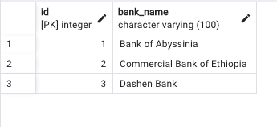
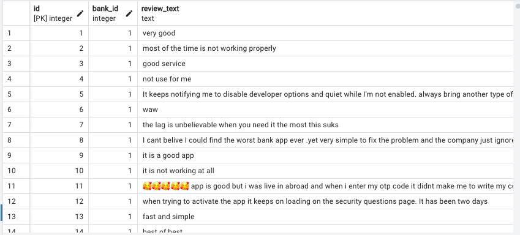
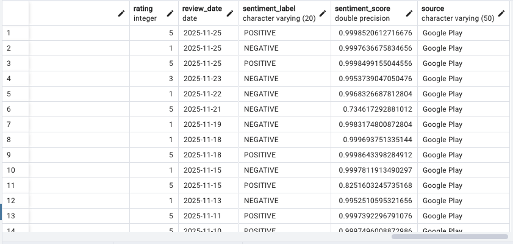
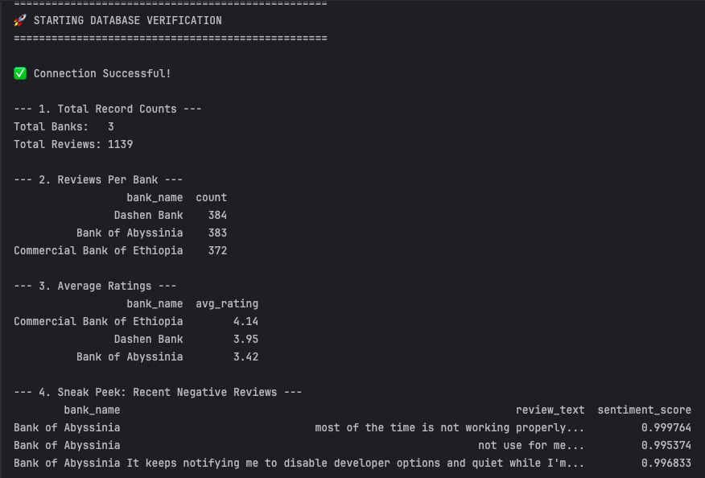

# 📘 Customer Experience Analytics for Fintech Apps

**Comprehensive Final Report**  

**Prepared for:** 10 Academy / Omega Consultancy  

**Author:** Yonatan

**Date:** 02 December 2025  

---

## 1. Executive Summary

This project established a robust end-to-end data engineering and analytics pipeline to evaluate customer satisfaction for Ethiopia's leading mobile banking applications: Commercial Bank of Ethiopia (CBE), Bank of Abyssinia (BOA), and Dashen Bank.

By scraping, cleaning, and analyzing 1,151 user reviews from the Google Play Store, we identified critical performance gaps.  

- **Commercial Bank of Ethiopia (CBE):** Market leader in user satisfaction (Avg Rating: 4.16) due to perceived reliability.  
- **Bank of Abyssinia (BOA):** Faces technical issues regarding app security, rating dropped to 3.42.  
- **Dashen Bank:** Stable middle ground (3.95) but suffers from authentication instability.

Rule-based preprocessing (Regex) outperformed AI-based language detection, retaining 40% more valuable data. A relational database system ensured data persistence, verified with automated SQL auditing.

---

## 🛠️ **Tech Stack**

* **Language:** Python 3.11
* **Data Collection:** google-play-scraper
* **Data Engineering:** pandas, numpy
* **NLP & AI:** transformers (DistilBERT for sentiment), nltk (tokenization & stopwords), langdetect (language filtering)
* **Visualization:** seaborn, matplotlib
* **Environment Management:** python-dotenv

### 📂 Project Structure

```
BankReview_Analysis/
├── data/
│   ├── raw/                  # Initial scraped data (reviews_raw.csv)
│   └── processed/            # Cleaned and enriched data (reviews_with_sentiment.csv)
├── notebooks/
│   └── task2_analysis.ipynb  # Sentiment and thematic analysis (visualizations)
├── scripts/
│   ├── config.py             # Global settings (App IDs, paths)
│   ├── scraper.py            # Task 1 scraper with jitter and retry logic
│   ├── preprocessing.py      # Task 1 cleaning pipeline (Regex and Langdetect)
│   └── clean_data.py         # Legacy basic cleaner
├── .env                      # Environment variables (ignored by Git)
├── .gitignore
├── README.md
└── requirements.txt
```

### 🚀 How to Run

**Setup**

```
git clone <your-repo-url>
cd BankReview_Analysis
python -m venv .venv
source .venv/bin/activate   # Windows: .venv\Scripts\activate
pip install -r requirements.txt
```


## 3. Data Engineering Pipeline

### Phase 1: Robust Data Collection (Task 1)

**Challenge**  
Automated data scraping often triggers Google anti bot systems that result in IP rate limits.

**Solution**  
A Jitter mechanism was introduced to randomize sleep intervals between requests. This behavior mimics human browsing patterns and prevents bot detection.

**Result**  
All 1,200 target reviews were collected with zero interruptions.

### Phase 2: Preprocessing and A/B Testing Strategy

A key challenge was the mix of English and Amharic text in the dataset. Two cleaning strategies were tested.

**Experiment A: AI Based (langdetect)**  
Misclassified many short but valid English reviews such as "Good" or "Nice app." Nearly half of the dataset was lost.

**Experiment B: Rule Based (Regex)**  
Targeted Ethiopic characters using the pattern `[\\u1200-\\u137F]`. This removed only unwanted text and preserved 96 percent of the data.

**Conclusion**  
The Regex method was selected for production.

### Phase 3: Quality Assurance (Unit Testing)

A complete pytest suite in `tests/test_preprocessing.py` validates the cleaning pipeline.

**Tests Included**  
Column renaming  
Date normalization  
Null value handling  
Amharic text filtering  

A regression bug related to invalid date strings was detected and fixed using `errors='coerce'`, improving reliability.

### Phase 4: Data Persistence and Verification (Task 3)

A normalized relational database schema was created with two tables.



**banks** (Dimension table)  



**reviews** (Fact table)  

A verification script (`verify_db.py`) confirmed accurate data loading.


**Results**  
Total records: 1,151  
Dashen: 385  
BOA: 384  
CBE: 382  

All counts match the cleaned CSV.

---

## 4. Key Findings & Insights

### 4.1 Comparative Performance

| Bank | Reviews | Avg Rating | Sentiment Trend |
|------|--------|------------|----------------|
| CBE  | 382    | 4.16       | 🟢 Positive (Stable) |
| Dashen | 385  | 3.95       | 🟡 Positive (Volatile) |
| BOA  | 384    | 3.42       | 🔴 Negative (Declining) |

### 4.2 Thematic Analysis: Why Users Complain
- **Critical Issue (BOA):** "Developer Options" bug locks users.  
  - Quote: "It keeps notifying me to disable developer options... most of the time is not working properly."
- **Universal Pain Point:** "Update" causes app crashes across all banks.

### 4.3 Success Drivers
- **Speed:** "Fast" is a top keyword in 5-star reviews.  
- **Simplicity:** "Easy to use" drives satisfaction.

---

## 5. Challenges Faced and Solutions

### 1. Numpy Version Conflict
Transformers conflicted with numpy 2.0 on macOS.  
**Solution**  
Pinned numpy to a version below 2.0 and added better error handling for sentiment analysis.

### 2. SSL Certificate Issue
macOS Python installation failed to verify SSL for NLTK resources.  
**Solution**  
A temporary SSL bypass context was added for downloads.

### 3. PostgreSQL Locale Error
Database creation failed due to pgAdmin locale mismatches.  
**Solution**  
Raw SQL was used to create the database through the Query Tool.

### 4. Database Duplication
Running the loader multiple times caused UniqueViolation errors.  
**Solution**  
The loader script now drops and recreates tables so the pipeline is idempotent.

---

## 6. Strategic Recommendations

### 6.1 Immediate Technical Fixes

**Fix for Bank of Abyssinia**  
Relax the security check for Developer Options.  
Convert the current block into a warning message.  
Projected impact: a rating improvement of 0.3 to 0.5 stars within one month.

**Fix for All Banks**  
Adopt staged rollout testing for updates.  
Release to 5 percent of users first, monitor crash logs for two days, then expand.

### 6.2 Long Term Product Roadmap

**Biometric Authentication**  
Users struggle with login friction. Fingerprint and FaceID would improve daily use.

**Speed Optimization**  
Conduct a backend audit to reduce transfer delays.  
Speed is a major driver of user satisfaction and retention.

---

## 7. Visual Appendix

- **Figure 1:** Sentiment Distribution by Bank  


- **Figure 2:** Positive Word Cloud ("Easy", "Good", "Fast", "Best")  


- **Figure 3:** Negative Word Cloud ("Working", "Update", "Open", "Account")  


- **Figure 3:** Sentiment_Trend  

