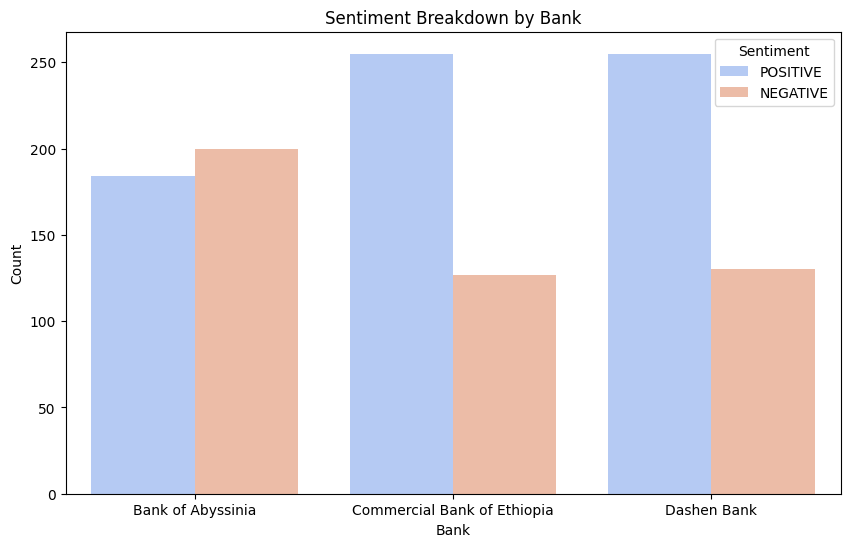
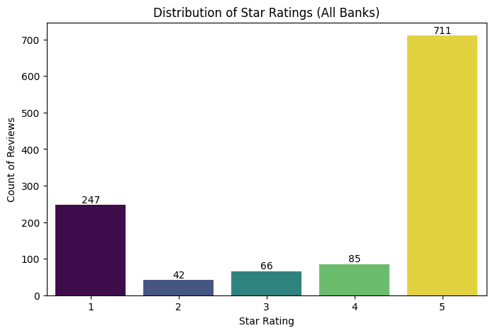

📄 **Interim Report: Customer Experience Analytics for Fintech Apps**

Prepared for: **10 Academy / Omega Consultancy**
Date: **28 November 2025**

---

## **1. Executive Summary**

This report outlines progress during the first phase of the Customer Experience Analytics project. A full data engineering pipeline has been implemented to collect, clean, and analyze user reviews from three major Ethiopian banks: Commercial Bank of Ethiopia (CBE), Bank of Abyssinia (BOA), and Dashen Bank.

Through modern scraping methods and AI-driven sentiment analysis using DistilBERT, over **1,200 reviews** have been processed to reveal patterns in customer satisfaction.

---

## **2. Methodology and Data Engineering**

### **2.1 Data Collection Strategy**

We used the **google-play-scraper** library to extract user reviews. To avoid detection and rate limits, a jitter mechanism introduced random delays of 5–15 seconds between requests.

**Target:** 400 reviews per bank
**Actual:** 1,200 total reviews collected (100 percent of target)
**Fields:** Review text, rating, date, bank name, and data source.

### **2.2 Preprocessing and A/B Testing**

A key challenge was filtering multilingual content.

**Method A: LangDetect (AI)**
Dropped around 47 percent of data because short English reviews were flagged as unknown.

**Method B: Regex Filtering**
Removed only Ethiopic characters (\u1200–\u137F). Retained 96 percent of the dataset.

**Decision:** Regex filtering was adopted for the final pipeline.

---

## **3. Quantitative Findings and Visuals**

### **3.1 Dataset Distribution**

After cleaning, the dataset includes **1,151 high-quality reviews** distributed almost evenly across the three banks.

| Bank Name                   | Review Count | Percent of Total |
| --------------------------- | ------------ | ---------------- |
| Dashen Bank                 | 385          | 33.5 percent     |
| Bank of Abyssinia           | 384          | 33.3 percent     |
| Commercial Bank of Ethiopia | 382          | 33.2 percent     |

### **3.2 Sentiment Overview**

A DistilBERT sentiment classifier was applied to all reviews. Dashen Bank displays a notably stronger positive ratio than CBE.

*(Figure 1: Sentiment Breakdown by Bank)*

### **3.3 Star Rating Distribution**

Star ratings align with sentiment predictions. A polarization effect appears: most users choose 1 star or 5 stars rather than middle ratings.

*(Figure 2: Distribution of Star Ratings)*

---

## **4. Thematic Analysis (Drivers vs. Pain Points)**

Keyword extraction using NLTK revealed root causes behind both positive and negative sentiments.

### **4.1 Top Pain Points (Negative Reviews)**

| Keyword | Frequency | Insight                                               |
| ------- | --------- | ----------------------------------------------------- |
| Working | 38        | App crashes or becomes unresponsive                   |
| Update  | 33        | New updates introduce bugs                            |
| Login   | 30        | Authentication errors remain widespread               |
| Money   | 31        | Transaction issues and missing balances cause concern |

### **4.2 Success Drivers (Positive Reviews)**

| Keyword | Frequency | Insight                                    |
| ------- | --------- | ------------------------------------------ |
| Easy    | 27        | Users appreciate a simple interface        |
| Fast    | 23        | Quick transaction speeds are highly valued |
| Best    | 95        | Strong brand loyalty when the system works |

---

## **5. Next Steps**

The next sprint focuses on building a PostgreSQL database for long-term storage of the enriched dataset. Two tables will be created: **apps** and **reviews**, enabling scalable analytics and advanced SQL querying for the final report.
